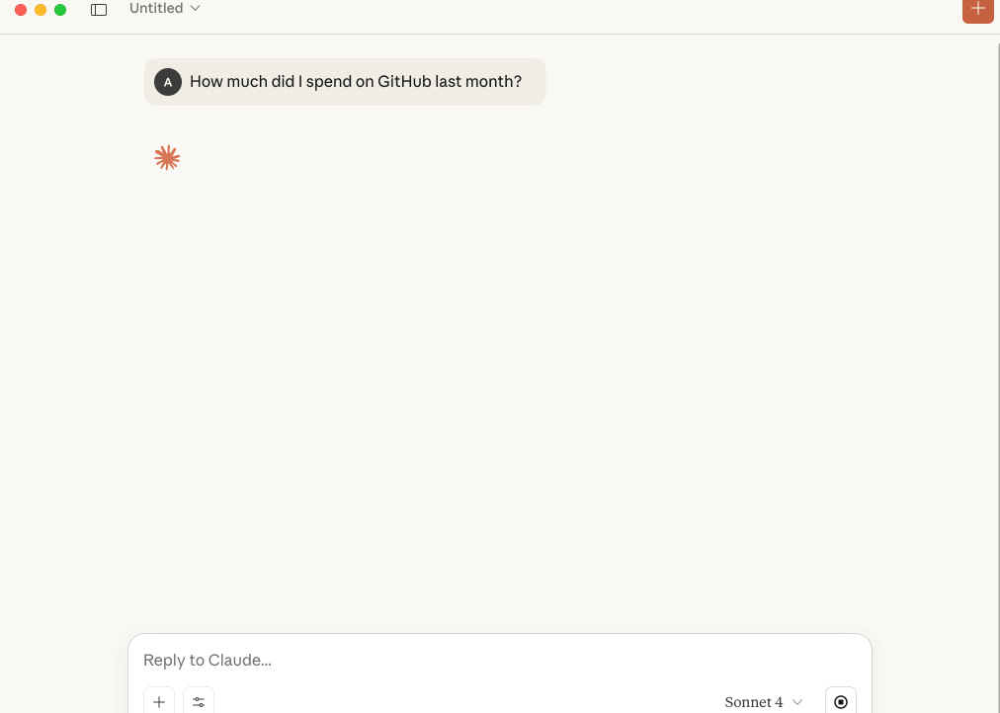
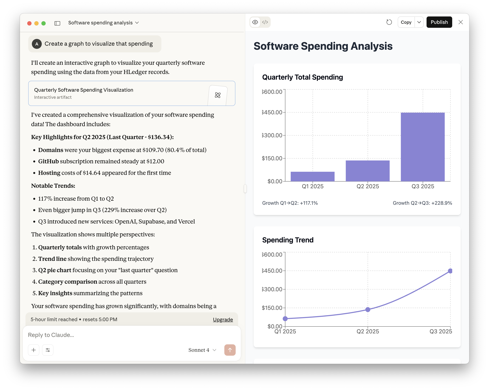

# HLedger MCP Server


A Model Context Protocol (MCP) server that provides AI assistants (MCP Clients) with direct access to [HLedger](https://hledger.org/) accounting data and functionality. This server enables AI applications to query account balances, generate financial reports, add new entires, and analyze accounting data through a standardized protocol.

It has support for most `hledger` cli commands, the ability to fetch an traverse `!include`'d journal files, and a safe `--read-only` mode. I hope you find it useful!

Published on npm as [@iiatlas/hledger-mcp](https://www.npmjs.com/package/@iiatlas/hledger-mcp), and available as an installable `.mcpb` file from [releases](https://github.com/iiAtlas/hledger-mcp/releases).

## Features

The HLedger MCP server provides comprehensive access to HLedger's financial reporting capabilities through the following tools:

### Core Accounting

- **Accounts** - List and query account names and structures
- **Balance** - Generate balance reports with extensive customization options
- **Register** - View transaction registers and posting details
- **Print** - Output journal entries and transactions

### Financial Reports

- **Balance Sheet** - Generate balance sheet reports
- **Balance Sheet Equity** - Balance sheet reports with equity details
- **Income Statement** - Profit & loss statements
- **Cash Flow** - Cash flow analysis and reports

### Data Analysis

- **Stats** - Statistical analysis of journal data
- **Activity** - Account activity and transaction frequency analysis
- **Payees** - List and analyze transaction payees
- **Descriptions** - Transaction description analysis
- **Tags** - Query and analyze transaction tags
- **Notes** - List unique transaction notes and memo fields
- **Files** - List data files used by hledger

### Resource Integration

- Automatically registers the primary journal and every file reported by `hledger files` as MCP resources so clients can browse and retrieve the source ledgers

### Journal Updates

- **Add Transaction** - Append new, validated journal entries with optional dry-run support
- **Find Entry** - Locate complete transactions (with file and line metadata) matching any hledger query
- **Remove Entry** - Delete a transaction safely using its exact text and location, with optional dry-run
- **Replace Entry** - Swap an existing transaction for new content after validating the change
- **Import Transactions** - Safely ingest batches of entries from external journal files or other supported formats
- **Close Books** - Generate closing/opening, retain-earnings, or assertion transactions and append them safely
- **Rewrite Transactions** - Add synthesized postings to matching entries using hledger's rewrite command

### Web Interface

You can open up the hledger web UI directly within the MCP server!

- **Start Web** - Launches `hledger web` in the requested mode without blocking the MCP server
  - _Requires the optional `hledger-web` executable_. If your `hledger` binary does not recognize the `web` command, install `hledger-web` (often a separate package) or point the MCP server at an executable built with web support.
  - Set `HLEDGER_WEB_EXECUTABLE_PATH` to force the MCP server to use a dedicated binary (such as `hledger-web`) for launching the web interface.
- **List/Stop Web Instances** - Enumerate all running web servers started during the session, gracefully terminate one or all

Read-only MCP sessions always run the web interface in `view` mode, while write-enabled sessions default to `add` permissions unless `allow: "edit"` is requested explicitly.

## Demo

A general summary:


Querying and adding new entries:



Create artifacts from the journal data:


## Prerequisites

- **HLedger** must be installed and accessible in your system PATH
  - Install from [hledger.org](https://hledger.org/)
  - Verify installation: `hledger --version`
- **Node.js** v18 or higher

## Usage

### Claude Desktop Configuration

### Installing the .mcpb file

The easiest way to install the extension is through the `.mcpb` file provided on [releases](https://github.com/iiAtlas/hledger-mcp/releases). If you prefer npm, you can use the method below.

### Installing via NPM

Add the following to your Claude Desktop configuration file:

**macOS**: `~/Library/Application Support/Claude/claude_desktop_config.json`

**Windows**: `%APPDATA%/Claude/claude_desktop_config.json`

```json
{
  "mcpServers": {
    "hledger": {
      "command": "npx",
      "args": ["-y", "@iiatlas/hledger-mcp", "/path/to/your/master.journal"]
    }
  }
}
```

Replace `/path/to/your/master.journal` with the actual path to your HLedger journal file. If you have a `master.journal` I'd recommend that, as this tool has support for any other files brought in using HLedgers existing `!include` syntax. See [test/resources/master.journal](test/resources/master.journal) for an example journal.

#### Configuration options

You can toggle write behaviour with optional flags:

- `--read-only` &mdash; disables the add-transaction tool entirely; all write attempts return an error.
- `--skip-backup` &mdash; prevents the server from creating `.bak` files before appending to an existing journal.

Flags may appear before or after the journal path. Both options default to `false`. I recommend starting with `--read-only` enabled until you get more comfortable with the tool. Below is that sample config:

```json
{
  "mcpServers": {
    "hledger": {
      "command": "npx",
      "args": [
        "-y",
        "@iiatlas/hledger-mcp",
        "/path/to/your/master.journal",
        "--read-only"
      ]
    }
  }
}
```

#### Environment variables

MCP clients that prefer configuration via environment variables can set:

- `HLEDGER_READ_ONLY` &mdash; set to `true` to force read-only mode.
- `HLEDGER_SKIP_BACKUP` &mdash; set to `true` to disable automatic `.bak` backups.
- `HLEDGER_EXECUTABLE_PATH` &mdash; (Optional) absolute path to a specific `hledger` binary if it isn't on PATH; overrides auto-detection.
- `HLEDGER_WEB_EXECUTABLE_PATH` &mdash; (Optional) absolute path to a standalone `hledger web` binary (for example `hledger-web`). When set, the MCP uses this executable instead of running `hledger web` via the primary binary.

The read/write toggles mirror the CLI flags above—CLI arguments take precedence if both are provided.

You can also use environment variables in place of `args` in the json config. Here is an example:

```json
{
  "mcpServers": {
    "hledger": {
      "command": "npx",
      "args": ["-y", "@iiatlas/hledger-mcp", "/path/to/your/master.journal"],
      "env": {
        "HLEDGER_READ_ONLY": "true",
        "HLEDGER_EXECUTABLE_PATH": "/opt/homebrew/bin/hledger"
      }
    }
  }
}
```

### Other MCP Clients

For other MCP-compatible applications, run the server with:

```bash
npx @iiatlas/hledger-mcp /path/to/your/master.journal
```

The server communicates via stdio and expects the journal file path as the first argument.

### Write tools

When the server is not in `--read-only` mode, these tools can modify the primary journal:

- `hledger_add_transaction` accepts structured postings and appends a new transaction after validating with `hledger check`. Enable `dryRun` to preview the entry without writing.
- `hledger_remove_entry` deletes a transaction by exact text and location, re-validating with `hledger check` and respecting optional backups.
- `hledger_replace_entry` swaps an existing entry for new content, keeping spacing tidy and performing a validation pass before committing.
- `hledger_import` wraps `hledger import`, running the command against a temporary copy of the journal. Provide one or more `dataFiles` (journal, csv, etc.) and an optional `rulesFile`; set `dryRun` to inspect the diff before committing. Successful imports create timestamped `.bak` files unless `--skip-backup` is active.
- `hledger_rewrite` runs `hledger rewrite` on a temporary copy, letting you specify one or more `addPostings` instructions for matching transactions. Use `dryRun` for a diff-only preview or `diff: true` to include the patch output alongside the applied change.
- `hledger_close` produces closing/opening assertions, retain-earnings, or clopen transactions via `hledger close`. Preview the generated entries with `dryRun`, then append them atomically (with optional backups) once you’re satisfied.

All write tools include a `dryRun` parameter to "try it out" before writing.

### Web tools

- `hledger_web` launches the hledger web UI/API on a free port unless a specific port/socket is supplied. The response includes an `instanceId` that can be used to track or terminate the server later.
- `hledger_web_list` returns metadata for each active web instance started by this MCP session (PID, command, base URL, access mode, etc.).
- `hledger_web_stop` stops a selected instance by `instanceId`, `pid`, or `port`, or stops everything with `all=true`. You can optionally choose the shutdown signal (`SIGTERM` by default) and timeout.

When the MCP server runs in read-only mode every web instance is forced to `allow: "view"`. Otherwise the server defaults to `allow: "add"` unless `allow: "edit"` is explicitly requested.

## Example Queries

Once configured, you can ask Claude natural language questions about your financial data:

- "What's my current account balance?"
- "Show me a balance sheet for last quarter"
- "What were my expenses in the food category last month?"
- "Generate an income statement for 2024"
- "Who are my top payees by transaction volume?"
- "Show me cash flow for the past 6 months"

## Tool Parameters

Most tools support common HLedger options including:

- **Date ranges**: `--begin`, `--end`, `--period`
- **Output formats**: `txt`, `csv`, `json`, `html`
- **Account filtering**: Pattern matching and regex support
- **Calculation modes**: Historical, cumulative, change analysis
- **Display options**: Flat vs tree view, sorting, percentages

## Development

### Building from Source

```bash
# Clone the repository
git clone <repository-url>
cd hledger-mcp

# (Optional) If you have nvm, use this version
nvm use

# Install dependencies
npm install

# Build the server
npm run build

# Test
npm run test

# Run the debug server
npm run debug
```

### Project Structure

```
src/
├── index.ts              # Main server entry point
├── base-tool.ts          # Base tool classes and utilities
├── executor.ts           # Command execution utilities
├── journal-writer.ts     # Safe journal writing operations
├── resource-loader.ts    # MCP resource discovery and loading
├── types.ts              # Shared type definitions
└── tools/                # Individual tool implementations
    ├── accounts.ts       # List account names and structures
    ├── activity.ts       # Account activity analysis
    ├── add.ts            # Add new transactions
    ├── balance.ts        # Balance reports
    └── ...               # ...and many more

test/
├── resources/            # Test journal files
│   ├── master.journal    # Example master journal with includes
│   ├── 01-jan.journal    # Monthly journal files
│   ├── 02-feb.journal
│   └── ...
├── *.test.ts            # Unit tests for tools and utilities
└── ...
```

## Troubleshooting

### "hledger CLI is not installed"

Ensure HLedger is installed and available in your PATH:

```bash
hledger --version
```

The hledger cli path attempts to be found automatically at common location (see [hledger-path.ts:8](src/hledger-path.ts)). If that's not working, you can set the `HLEDGER_EXECUTABLE_PATH` environment variable to the discrete path.

```bash
# Find hledger installation path
which hledger
```

### "hledger web command is failing"

Not all instances of hledger include the `hledger-web` binary. Additionaly, some installation methods (like `.mcpb`) have a hard time finding it. If you're struggling to launch the web UI I'd recommend first installing or finding the current installation:

```bash
# Find hledger-web installation path
which hledger-web
```

Then setting that to the environment variable. For my installation via homebrew, that's:

```
HLEDGER_WEB_EXECUTABLE_PATH=/opt/homebrew/bin/hledger-web
```

### "Journal file path is required"

The server requires a journal file path as an argument. Check your config to make sure one is included, and valid.

### Claude Desktop Connection Issues

1. Verify the journal file path is correct and accessible
2. Check that the configuration file syntax is valid JSON
3. Restart Claude Desktop after configuration changes

## License

MIT License (See [LICENSE](LICENSE))

## Contributing

See `CONTRIBUTING.md` for setup instructions, coding standards, and tips on testing and debugging changes locally. We welcome issues and pull requests!

## Related Projects

- [HLedger](https://hledger.org/) - The underlying accounting software
- [Model Context Protocol](https://modelcontextprotocol.io/) - The protocol specification
- [Claude Desktop](https://claude.ai/) - AI assistant that supports MCP servers
