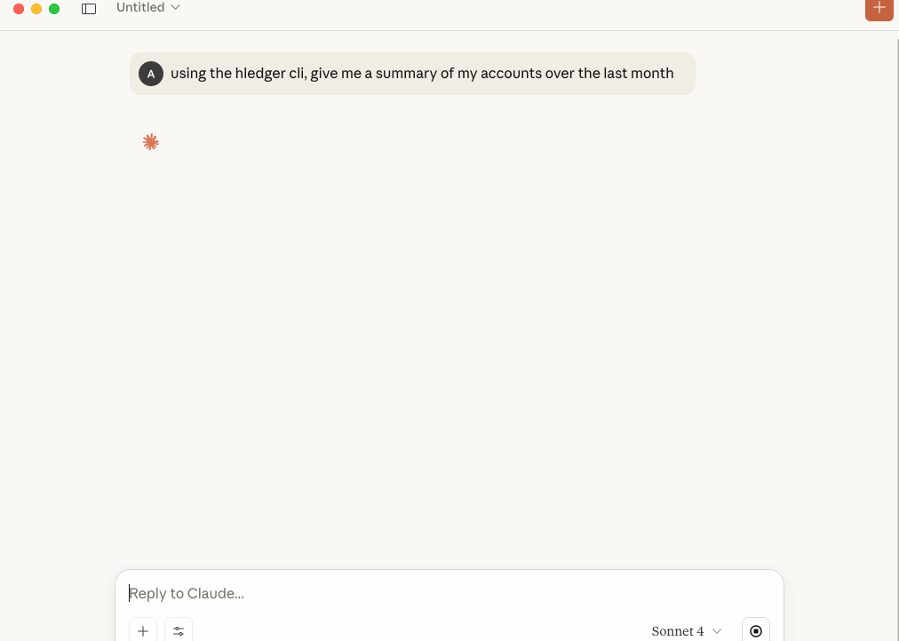

# HLedger MCP Server


A Model Context Protocol (MCP) server that provides AI assistants (MCP Clients) with direct access to [HLedger](https://hledger.org/) accounting data and functionality. This server enables AI applications to query account balances, generate financial reports, add new entires, and analyze accounting data through a standardized protocol.

It has support for most `hledger` cli commands, the ability to fetch an traverse `!include`'d journal files, and a safe `--read-only` mode. I hope you find it useful!

## Features

The HLedger MCP server provides comprehensive access to HLedger's financial reporting capabilities through the following tools:

### Core Accounting

- **Accounts** - List and query account names and structures
- **Balance** - Generate balance reports with extensive customization options
- **Register** - View transaction registers and posting details
- **Print** - Output journal entries and transactions

### Financial Reports

- **Balance Sheet** - Generate balance sheet reports
- **Balance Sheet Equity** - Balance sheet reports with equity details
- **Income Statement** - Profit & loss statements
- **Cash Flow** - Cash flow analysis and reports

### Data Analysis

- **Stats** - Statistical analysis of journal data
- **Activity** - Account activity and transaction frequency analysis
- **Payees** - List and analyze transaction payees
- **Descriptions** - Transaction description analysis
- **Tags** - Query and analyze transaction tags
- **Notes** - List unique transaction notes and memo fields
- **Files** - List data files used by hledger

### Resource Integration

- Automatically registers the primary journal and every file reported by `hledger files` as MCP resources so clients can browse and retrieve the source ledgers

### Journal Updates

- **Add Transaction** - Append new, validated journal entries with optional dry-run support
- **Import Transactions** - Safely ingest batches of entries from external journal files or other supported formats
- **Close Books** - Generate closing/opening, retain-earnings, or assertion transactions and append them safely
- **Rewrite Transactions** - Add synthesized postings to matching entries using hledger's rewrite command

## Demo



## Prerequisites

- **HLedger** must be installed and accessible in your system PATH
  - Install from [hledger.org](https://hledger.org/)
  - Verify installation: `hledger --version`
- **Node.js** v18 or higher

## Usage

### Claude Desktop Configuration

Add the following to your Claude Desktop configuration file:

**macOS**: `~/Library/Application Support/Claude/claude_desktop_config.json`

**Windows**: `%APPDATA%/Claude/claude_desktop_config.json`

```json
{
  "mcpServers": {
    "hledger": {
      "command": "npx",
      "args": ["hledger-mcp", "/path/to/your/master.journal"]
    }
  }
}
```

Replace `/path/to/your/master.journal` with the actual path to your HLedger journal file. If you have a `master.journal` I'd recommend that, as this tool has support for any other files brought in using HLedgers existing `!include` syntax. See [test/resources/master.journal](test/resources/master.journal) for an example journal.

#### Configuration options

You can toggle write behaviour with optional flags:

- `--read-only` &mdash; disables the add-transaction tool entirely; all write attempts return an error.
- `--skip-backup` &mdash; prevents the server from creating `.bak` files before appending to an existing journal.

Flags may appear before or after the journal path. Both options default to `false`. I recommend starting with `--read-only` enabled until you get more comfortable with the tool. Below is that sample config:

```json
{
  "mcpServers": {
    "hledger": {
      "command": "npx",
      "args": ["hledger-mcp", "/path/to/your/master.journal", "--read-only"]
    }
  }
}
```

### Other MCP Clients

For other MCP-compatible applications, run the server with:

```bash
npx hledger-mcp /path/to/your/journal.ledger
```

The server communicates via stdio and expects the journal file path as the first argument.

### Write tools

When the server is not in `--read-only` mode, four tools can modify the primary journal:

- `hledger_add_transaction` accepts structured postings and appends a new transaction after validating with `hledger check`. Enable `dryRun` to preview the entry without writing.
- `hledger_import` wraps `hledger import`, running the command against a temporary copy of the journal. Provide one or more `dataFiles` (journal, csv, etc.) and an optional `rulesFile`; set `dryRun` to inspect the diff before committing. Successful imports create timestamped `.bak` files unless `--skip-backup` is active.
- `hledger_rewrite` runs `hledger rewrite` on a temporary copy, letting you specify one or more `addPostings` instructions for matching transactions. Use `dryRun` for a diff-only preview or `diff: true` to include the patch output alongside the applied change.
- `hledger_close` produces closing/opening assertions, retain-earnings, or clopen transactions via `hledger close`. Preview the generated entries with `dryRun`, then append them atomically (with optional backups) once you’re satisfied.

All write tools include a `dryRun` parameter to "try it out" before writing.

## Example Queries

Once configured, you can ask Claude natural language questions about your financial data:

- "What's my current account balance?"
- "Show me a balance sheet for last quarter"
- "What were my expenses in the food category last month?"
- "Generate an income statement for 2024"
- "Who are my top payees by transaction volume?"
- "Show me cash flow for the past 6 months"

## Tool Parameters

Most tools support common HLedger options including:

- **Date ranges**: `--begin`, `--end`, `--period`
- **Output formats**: `txt`, `csv`, `json`, `html`
- **Account filtering**: Pattern matching and regex support
- **Calculation modes**: Historical, cumulative, change analysis
- **Display options**: Flat vs tree view, sorting, percentages

## Development

### Building from Source

```bash
# Clone the repository
git clone <repository-url>
cd hledger-mcp

# (Optional) If you have nvm, use this version
nvm use

# Install dependencies
npm install

# Build the server
npm run build

# Test
npm run test

# Run the debug server
npm run debug
```

### Project Structure

```
src/
├── index.ts              # Main server entry point
├── base-tool.ts          # Base tool classes and utilities
├── executor.ts           # Command execution utilities
├── journal-writer.ts     # Safe journal writing operations
├── resource-loader.ts    # MCP resource discovery and loading
├── types.ts              # Shared type definitions
└── tools/                # Individual tool implementations
    ├── accounts.ts       # List account names and structures
    ├── activity.ts       # Account activity analysis
    ├── add.ts            # Add new transactions
    ├── balance.ts        # Balance reports
    └── ...               # ...and many more

test/
├── resources/            # Test journal files
│   ├── master.journal    # Example master journal with includes
│   ├── 01-jan.journal    # Monthly journal files
│   ├── 02-feb.journal
│   └── ...
├── *.test.ts            # Unit tests for tools and utilities
└── ...
```

## Troubleshooting

### "hledger CLI is not installed"

Ensure HLedger is installed and available in your PATH:

```bash
hledger --version
```

### "Journal file path is required"

The server requires a journal file path as an argument. Check your config to make sure one is included, and valid.

### Claude Desktop Connection Issues

1. Verify the journal file path is correct and accessible
2. Check that the configuration file syntax is valid JSON
3. Restart Claude Desktop after configuration changes

## License

GPL-3.0 License

## Contributing

See `CONTRIBUTING.md` for setup instructions, coding standards, and tips on testing and debugging changes locally. We welcome issues and pull requests!

## Related Projects

- [HLedger](https://hledger.org/) - The underlying accounting software
- [Model Context Protocol](https://modelcontextprotocol.io/) - The protocol specification
- [Claude Desktop](https://claude.ai/) - AI assistant that supports MCP servers
